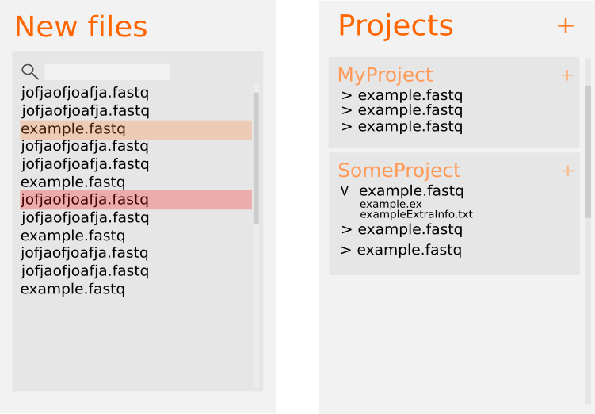

## Project Proposal 
### NGS application
John Busker, Ruben Hartsuiker, Sam Nelen and Wouter Zeevat

### which tools and methods are necessary to obtain your project goals?
Our project needs a Database, this is probably one of the most important things. A database needs to be made together with 
a database connecter within the java application.

### do they already exist or do you have to develop them yourself?
Luckily for us, the https://michielnoback.github.io/bincourses/webbased1.html gitbook contains instructions how to use the already existing mysql java library. This will be used with regard to connecting the database
to the application.

### what (technical) knowledge is needed to be able to successfully complete the project?
In order to be able to download projects and do analysis', a system needs to be made that downloads everything within the bin system so that the user can log out and it will still be downloading.
We do not have the full knowledge to do this yet and will be getting an old project that does such a thing from Marcel.
- The database itself also needs to be made in order for us to start building our application.

A little design we made to get a view of how things could look like.
